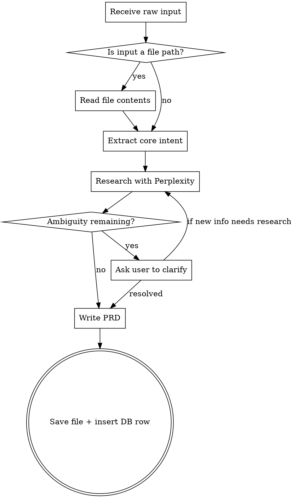

# Generate PRD

## Overview

Transform raw, unstructured project ideas into complete, machine-readable PRD documents. All tech stack decisions are backed by research, not assumptions.

## Input

Accept input in any of these forms:

- **Skill argument:** `/generate-prd "I want to build a ..."` or `/generate-prd path/to/transcript.txt`
- **Natural language:** User says "generate a PRD for ..." in conversation
- **File reference:** User points to a text file containing a voice transcript or notes

If the input is a file path, read the file first to extract the raw idea.

## Workflow



### Step 1: Extract Core Intent

Parse the raw input to identify:
- What the application does
- Who it's for
- Any stated constraints or preferences (language, framework, hosting, etc.)
- Implied scale and complexity

### Step 2: Research

**REQUIRED:** Use the `perplexity-research` skill to research ALL of the following before writing the PRD:

- Best practices for the type of application described
- Recommended tech stacks and architecture patterns for the use case
- Relevant libraries, frameworks, and tooling
- Similar applications and how they solve the problem
- Security considerations specific to the domain

Run multiple research queries to cover different angles. Do not guess at tech stack decisions.

### Step 3: Clarify (only if necessary)

If any aspect of the input is **genuinely ambiguous** and cannot be resolved through research or reasonable inference, ask the user for clarification. Prefer making a reasonable default choice over asking. Only ask when getting it wrong would meaningfully derail the project.

### Step 4: Write the PRD

Generate the PRD following the template below. Every section is mandatory.

### Step 5: Save and Register

1. Derive `{project-slug}` from the project name (lowercase, hyphens for spaces, strip special chars)
2. Create directory `./projects/{project-slug}/` if it doesn't exist
3. Write PRD to `./projects/{project-slug}/PRD.md`
4. Insert project into the database:

```bash
node -e "
import { initDb, createProject, closeDb } from './db.js';
initDb();
const id = createProject({
  name: 'Project Name',
  description: 'One-liner summary from PRD',
  prdFilePath: './projects/{project-slug}/PRD.md'
});
console.log('Created project with ID:', id);
closeDb();
"
```

## PRD Template

The generated PRD MUST include these sections in this exact order:

### 1. Title and Summary
One-liner description of the application. This becomes the `description` field in the database.

### 2. User Personas and Goals
Who uses this app and what they need to accomplish. Define 1-3 personas with concrete goals, not abstract roles.

### 3. Core Features
Broken down by domain or user journey. Each feature needs:
- What it does
- How the user interacts with it
- Edge cases and error states

### 4. Technical Architecture
Stack decisions, architecture patterns, infrastructure overview. Every technology choice MUST reference the research that justifies it. Structure as:
- **Language/Runtime**
- **Framework**
- **Database**
- **Key Libraries**
- **Architecture Pattern** (monolith, microservices, serverless, etc.)

### 5. Integrations and Dependencies
External services, APIs, libraries. For each: what it provides, why it was chosen over alternatives.

### 6. Success Metrics and Acceptance Criteria
Testable criteria for each core feature. Written as "Given X, when Y, then Z" or equivalent concrete statements.

### 7. Known Constraints and Limitations
Technical, business, or scope constraints. Be honest about what this version does NOT do.

### 8. Deployment Intent
High level only. Examples: "Web app deployed on AWS via CI/CD", "Local Docker image", "Static site on Cloudflare Pages". NOT detailed infrastructure configuration.

## Rules

- **No time estimates** anywhere in the document
- **No open questions section** - all ambiguities must be resolved before the PRD is finalised
- **Tech stack decisions must be justified by research** - never assume a stack without evidence
- **One file** - the PRD is a single markdown document
- **Project slug** - derived from project name: lowercase, hyphens, no special characters
