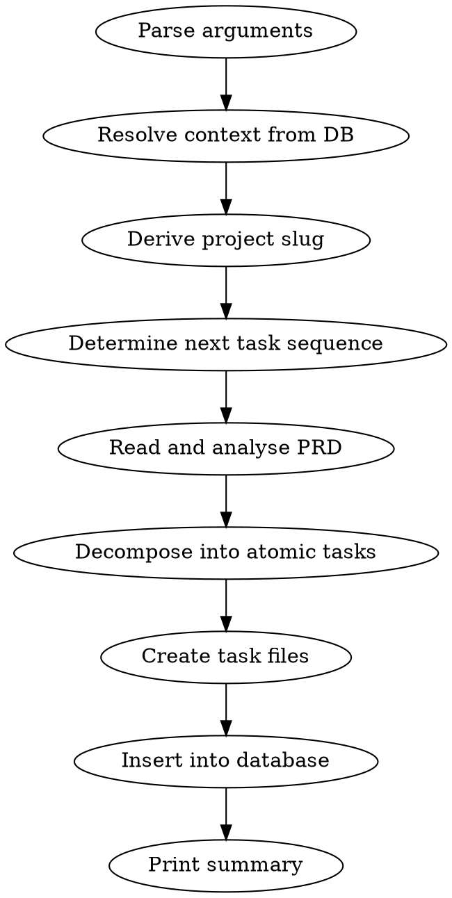

# Generate Tasks

## Overview

Decompose a single PRD phase into atomic, implementable task files and corresponding database rows. Each task is scoped to fit within a single Claude Code agent context window and includes mandatory testing requirements (TDD).

## Workflow



### Step 1: Parse Arguments

Extract `project_id` and `phase_id` from `$ARGUMENTS`. Both are required integers.

If either is missing or not a valid integer, print usage and stop:

```
Usage: generate-tasks project_id=<id> phase_id=<id>

Both project_id and phase_id are required integers.
```

### Step 2: Resolve Context from Database

Run these commands to retrieve project and phase information:

```bash
node db-query.js get_project <project_id>
```

```bash
node db-query.js get_phase <phase_id>
```

Validate:
- The project exists (check `ok` is true in the response)
- The phase exists (check `ok` is true in the response)
- The phase belongs to the project (the phase's `project_id` field matches the provided `project_id`)

If any validation fails, print the error and stop.

Extract from the responses:
- **project name** - from the project record
- **prd_file_path** - from the project record
- **phase_name** - from the phase record

### Step 3: Derive Project Slug

From the project name: lowercase, replace spaces and special characters with hyphens, strip leading/trailing hyphens.

Example: "Anti-ADHD Kanban" becomes `anti-adhd-kanban`

### Step 4: Determine Next Task Sequence Number

Run:

```bash
node db-query.js get_phase_tasks <project_id> <phase_id>
```

Count the existing tasks in the response. The next task number is `existing_count + 1`.

### Step 5: Read and Analyse the PRD

Read the PRD file at the `prd_file_path` from Step 2.

Identify ALL features and requirements that belong to the specified phase:
- If the PRD has explicit phase assignments, use those
- If not, use the phase name to match relevant sections

### Step 6: Decompose into Atomic Tasks

For each requirement identified in Step 5, create a task definition with:

- **task_id**: `TASK-{NNN}` where NNN is zero-padded to 3 digits, starting from the sequence number determined in Step 4
- **title**: Short, descriptive imperative statement
- **description**: Detailed description of exactly what needs to be implemented
- **feature_area**: e.g., "backend", "frontend", "database", "infrastructure"
- **priority**: "critical", "high", "medium", or "low"
- **dependencies**: Array of TASK-XXX IDs that must complete first (only reference tasks within this project). Use `[]` if none.
- **files_to_create_or_modify**: Explicit file paths with (create) or (modify) annotations
- **acceptance_criteria**: Checklist of conditions that must be true for the task to be done
- **testing_requirements**: Specific tests that must be written and passing. TDD is mandatory — tests are written first.
- **relevant_context**: Architectural decisions, patterns, PRD references

Decomposition rules:
- Each task must be atomic enough for a single Claude Code agent to implement within one context window
- No time estimates anywhere
- Every task MUST have testing requirements — TDD is mandatory
- Dependencies must reference valid TASK-XXX IDs within the same project
- File paths must be explicit and consistent with the project architecture in the PRD

### Step 7: Create Task Files

For each task, create the directory (if it does not exist) and write the markdown file.

**Directory:** `./projects/{project-slug}/tasks/{phase-name}/`

**Filename:** `{task-id}-{task-slug}.md` where task-slug is derived from the title (lowercase, hyphens, no special characters).

**Template:**

```markdown
# Task: {title}

## Task ID
{task_id}

## Phase
{phase_name}

## Feature Area
{feature_area}

## Priority
{priority}

## Dependencies
{comma-separated list of TASK-XXX ids, or "None"}

## Description
{detailed description of exactly what needs to be implemented}

## Files to Create or Modify
{explicit list with (create) or (modify) annotations}

## Acceptance Criteria
{checklist items, each starting with "- [ ] "}

## Testing Requirements
{specific tests — TDD mandatory, tests written first}

## Relevant Context
{architectural decisions, existing patterns, PRD references}
```

### Step 8: Insert into Database

For each task, run:

```bash
node db-query.js create_task <project_id> <phase_id> "<title>" <priority> "<task_file_path>" "<description>" "<feature_area>" '<dependencies_json>'
```

Note: Quote arguments that contain spaces. Dependencies must be a valid JSON array string like `'["TASK-001"]'` or `'[]'` for no dependencies.

### Step 9: Print Summary

Print a summary table showing all generated tasks:

```
Tasks generated for phase "{phase_name}" (project {project_id}):

| Task ID  | Title                              | Feature Area | Priority | Dependencies      |
|----------|------------------------------------|--------------|----------|-------------------|
| TASK-001 | Create database schema             | backend      | critical | None              |
| TASK-002 | Implement REST API endpoints       | backend      | high     | TASK-001          |
...

Total: N tasks created
Files written to: ./projects/{project-slug}/tasks/{phase-name}/
```

## Rules

- Every task must include a testing requirements section — TDD is mandatory, tests written first
- Tasks must be atomic enough to fit within a single Claude Code context window
- No time estimates anywhere
- Dependencies must reference valid TASK-XXX IDs within the same project
- File paths must be explicit and consistent with the project architecture defined in the PRD
- Task files are read-only once created — agents never modify them, only the database status is updated
- If the phase already has tasks, new tasks continue the sequence (re-runnable)
- All database operations go through db-query.js — never write raw SQL
