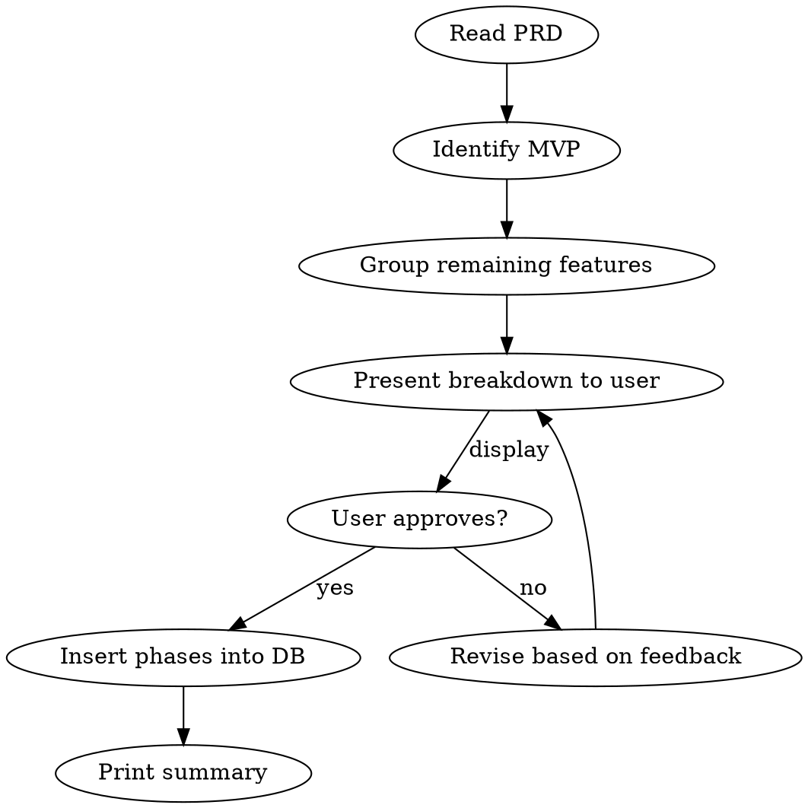

# Phase Splitting

Split a completed PRD into sequential release phases, from MVP through full feature delivery.

## Inputs

Two required arguments:
- `prd_path` - absolute path to the completed PRD markdown file
- `project_id` - integer ID from the projects table

## Workflow



### Step 1: Read and analyse the PRD

Read the PRD file at `prd_path`. Identify:
- All distinct features, capabilities, and requirements
- Dependencies between features (what requires what)
- Any explicit user preferences about MVP scope or phase ordering

### Step 2: Define MVP

MVP is the **minimum set of features for the core use case to work end-to-end**. Apply these rules:
- Only include what is strictly necessary for a user to complete the primary workflow
- If a feature is "nice to have" for the first release, it is NOT MVP
- If the user has stated preferences about MVP scope in the PRD or original input, respect those
- Infrastructure/setup that all later phases depend on belongs in MVP

### Step 3: Group remaining features into phases

Assign every non-MVP feature to a numbered phase (1.1, 1.2, 1.3, etc.) based on:
- **Dependencies** - features that depend on other post-MVP features go in later phases
- **Complexity** - don't overload a single phase
- **Value delivered** - each phase should deliver a meaningful, testable increment

Each phase must be:
- Independently releasable and testable
- Sequential - phase N assumes phase N-1 is complete

### Step 4: Present for approval

Display the proposed breakdown as a clear summary. For each phase show:
- Phase name (MVP, 1.1, 1.2, etc.)
- One-line description of the phase's focus
- Bullet list of features included

Ask the user to approve, or provide feedback for revision. **Do not write to the database until the user explicitly approves.**

### Step 5: Insert into database

On approval, use `db-query.js` to insert each phase:

```bash
# MVP is always phase_order 1 with status 'active'
node db-query.js create_phase <project_id> "MVP" 1 active

# All subsequent phases start as 'locked'
node db-query.js create_phase <project_id> "1.1" 2 locked
node db-query.js create_phase <project_id> "1.2" 3 locked
```

### Step 6: Print summary

After insertion, print a human-readable summary confirming what was written:

```
Phases created for project {project_id}:

  Phase 1 (MVP) [active]
    - Feature A
    - Feature B

  Phase 2 (1.1) [locked]
    - Feature C
    - Feature D
```

## Rules

- MVP phase: `status = 'active'`, `phase_order = 1`
- All other phases: `status = 'locked'`
- Phase order must be explicitly numbered and sequential
- Never skip user approval before writing to the database
- If phases already exist for the project, warn the user and ask how to proceed before inserting duplicates
